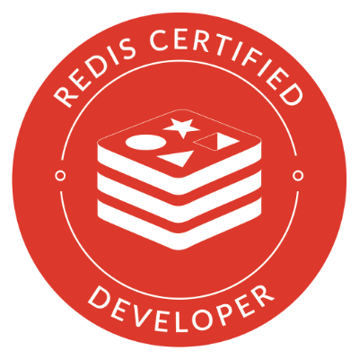
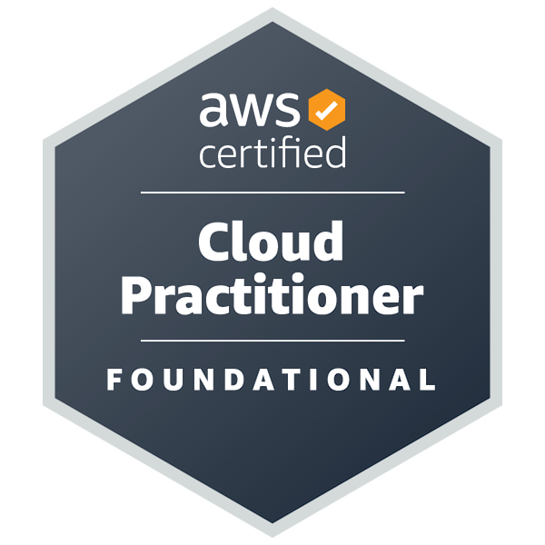
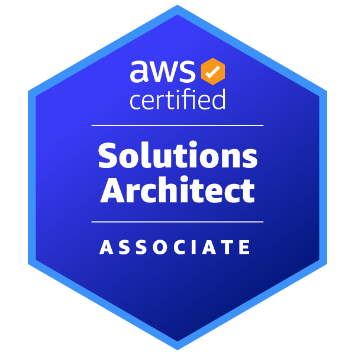

# Hi there I'm Mar(c|k|ek) 👋

## 📜 My certifications 📜

  
  
  
  

## 🌱 I'm currently learning 🌱

- HSK Chinese
- AWS Certified Solutions Architect - Professional
- AWS Certified Security - Specialty
- [Terraform](https://www.terraform.io/)
- [Kubernetes](https://kubernetes.io/)

<!--
**return-main/return-main** is a ✨ _special_ ✨ repository because its `README.md` (this file) appears on your GitHub profile.

Here are some ideas to get you started:

- 🔭 I’m currently working on ...
- 🌱 I’m currently learning ...
- 👯 I’m looking to collaborate on ...
- 🤔 I’m looking for help with ...
- 💬 Ask me about ...
- 📫 How to reach me: ...
- 😄 Pronouns: ...
- ⚡ Fun fact: ...
-->
