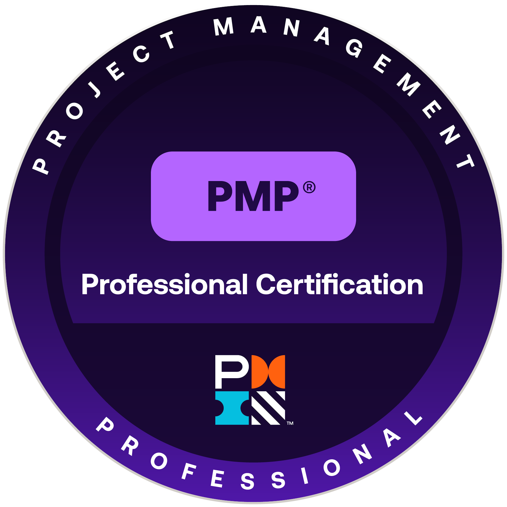
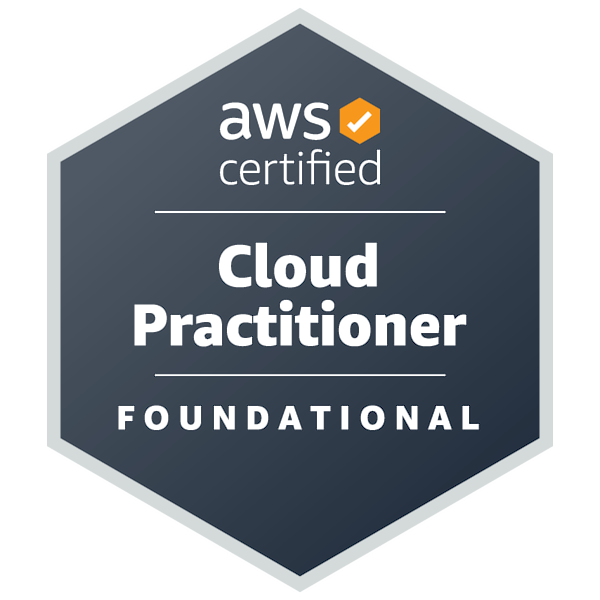
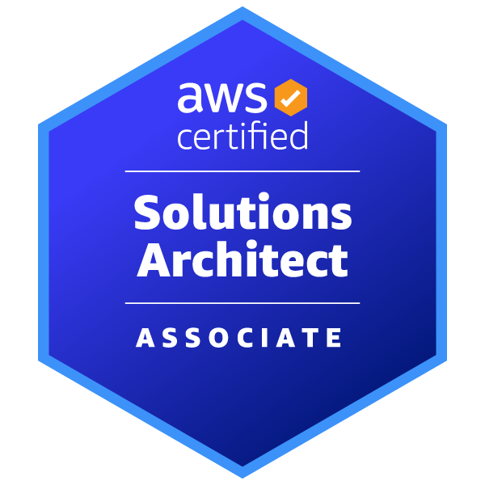
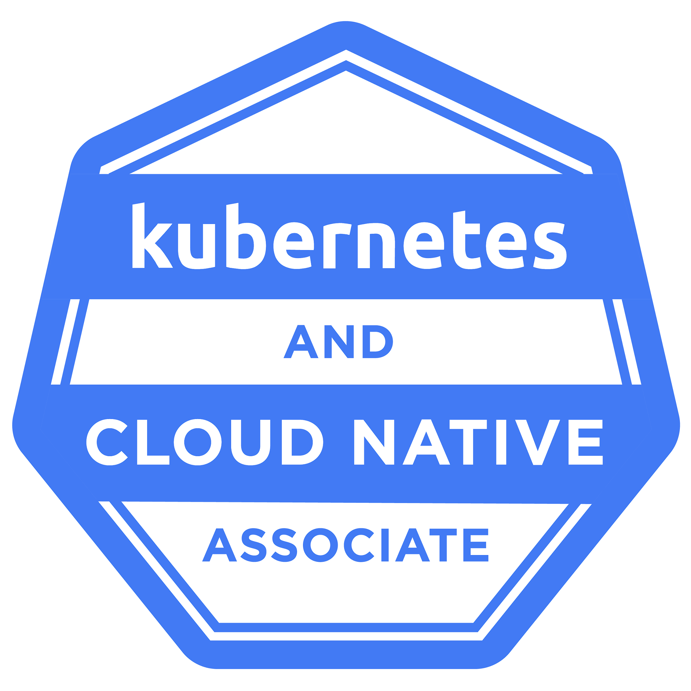
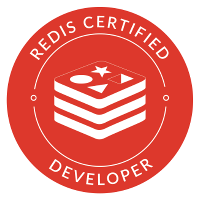
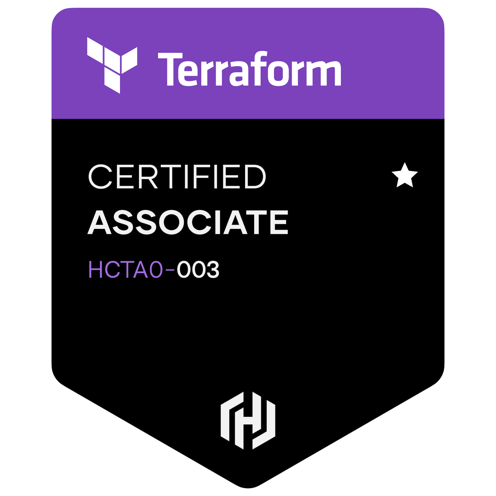

# Hi there I'm Mar(c|k|ek) 👋

## 📜 My certifications 📜

  <a href="https://www.credly.com/badges/0bcf85e6-7869-4986-a79f-572404bcd02d">
    
  <a href="https://www.credly.com/badges/7cf98e24-80c9-4d71-a78a-ee49d16edca1">
    
  <a href="https://www.credly.com/badges/5c8d52ff-a433-4faa-9a4d-f052c2822f1b">
    
  <a href="https://www.credly.com/badges/120001c7-12c1-4411-9913-9919959f404c">
    
  <a href="https://www.credential.net/9c18d864-cede-43b7-9469-a42dbbc8da09">
    
  <a href="https://www.credly.com/badges/d8d49b0c-023d-4298-9d35-e9afe8a00575">
    

## 🌱 I'm currently learning 🌱

- HSK Chinese
- AWS Certified Solutions Architect - Professional
- AWS Certified Security - Specialty
- [Kubernetes](https://kubernetes.io/)

<!--
**return-main/return-main** is a ✨ _special_ ✨ repository because its `README.md` (this file) appears on your GitHub profile.

Here are some ideas to get you started:

- 🔭 I’m currently working on ...
- 🌱 I’m currently learning ...
- 👯 I’m looking to collaborate on ...
- 🤔 I’m looking for help with ...
- 💬 Ask me about ...
- 📫 How to reach me: ...
- 😄 Pronouns: ...
- ⚡ Fun fact: ...
-->
